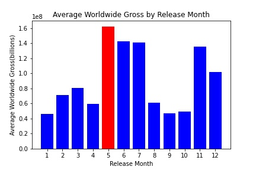
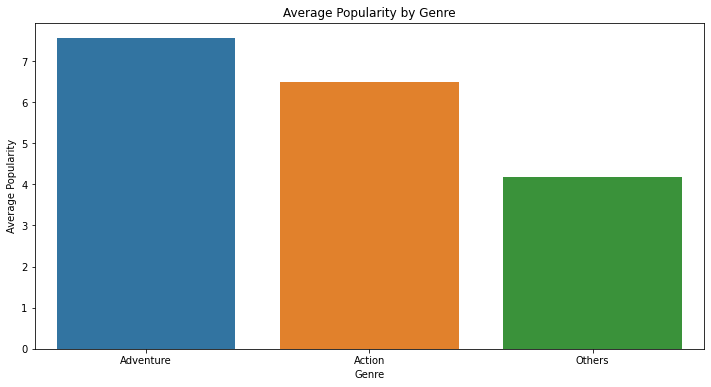

# Business Understanding

This project analyzes what types of films Microsoft should create in their new movie studio using various movie data sets. Microsoft currently does not know anything about creating movies and they need help in deciding what films to create. Exploring movie data sets will tell what types of films are doing the best in the box office and this well help Microsoft decide on which creative direction they should go in to be successful. 


# Data Understanding

Each dataset used in this project contains thousands of entries. The datasets are from
 * [Box Office Mojo](https://www.boxofficemojo.com/)
 * [IMDB](https://www.imdb.com/)
 * [Rotten Tomatoes](https://www.rottentomatoes.com/)
 * [The Movie DB](https://www.themoviedb.org/)
 * [The Numbers](https://www.the-numbers.com/)

They contain data such as movie titles/release date/domestic and worldwide gross/popularity and genre to name a few. The data used in this research is suitable for the project because it contains various information that shows what movies are doing or have done the best in the box office.

The 


# Data Preperation

Imported neccessary libraries such as pandas and numPy etc. I loaded all the files (data) properly. I ran various sets of code to preview the data frames and gather general information such as how many entries there were, how many missing values there were, how many columns etc. I cleaned up some of the data so that I could work with it. Some of the data cleaning involved was getting rid of missing data that was a small amount compared to the number of entries there were. Converting dates to proper date formatting, getting rid of commas and dollar signs in some of the data so that I could properly sort it etc. I sorted a lot of the data in certain columns such as "worldwide_gross" from highest to smallest to see what the highest grossing movies were.

# Exploratory Data Analysis

I ran some code to dive deeper into the analysis using visualizations to gain a better understanding of relationships between the data. I graphed histograms of some descriptive statistics of certain dataframes. I also graphed scatter plots and imported the library Seaborn to help create aesthethically pleasing visuals. I also used pair plots to help understand relationships between columns in dataframes to gain a better insight into the data to help draw some conclusions. 






# Conclusion

Through my analysis I found that the most popular movies in the box office over the past 10 years have been in the genre's of "Action" and "Adventure" (the most popular being "Action").

In general there is a positive correlation between production budget and worldwide/domestic gross. 

Director James Cameron had the 2 highest grossing movies according to the movie budgets data set. There are certain directors linked to high grossing films.


## Recommendations

Based on my findings I would recommend that Microsoft should create movies that are within the "Action" and "Adventure" genres as they have produced the highest grossing films. 

I would recommend that Microsoft be prepared to investment more money into the production budget. Higher production budgets are more likely to lead to a higher grossing film. 

Hiring a top director such as James Cameron (who has been proven to create the highest grossing films) would be highly beneficial in creating a potential best selling/successful movie. 


## Limitations

One limitation that I found while investigating the data sets was that there were too many missing values in certain data sets which effected my ability to use it. The biggest limitation was the lack of information on net profit for production companies. Having this information would help in determining a movie's a success. Looking into how much money went into advertising for example could be an element that would effect total profit. Having numbers on production budget and worldwide gross are very valuable but it still does not tell the whole story.


## Next Steps

Exploring more data sets is always helpful. The more information we have at our fingertips will only strenghten knowledge on a particular subject and lead to the best course of action. I would look into data sets focusing more on production companies to try and gather more information on what goes into making a successful film. Looking at data sets that have information on how much money went into advertising and also how long the movie was actively advertised for would be crucial to look at to ensure the best steps are being taken to produce a successful movie.

## For More Information

See the full analysis in the [Jupyter Notebook](notebook.ipynb) or review this [presentation](presentation.pdf).

For additional info, please see my repo [here](https://github.com/adammarianacci/Microsoft_Movie_Analysis).


## Repository Structure

```
├── images
├── README.md
├── presentation.pdf
└── notebook.ipynb
``` 


